# 🍽️ Sistema Integral de Restaurante — Restobar

<p align="center">
  <a href="https://github.com/Arg128/Proyecto-IPS-restobar">
    
  </a>
</p>

<p align="center">
  <strong>Sistema integral de gestión para restaurantes</strong><br/>
  Desarrollado como proyecto académico en el curso de Ingeniería y Procesos de Software (IPS) — UNSA 2026-A
</p>

<p align="center">
  <a href="https://github.com/Arg128/Proyecto-IPS-restobar/actions"></a>
  <a href="https://arg128.github.io/Proyecto-IPS-restobar"></a>
  <a href="./LICENSE"></a>
</p>

---

## Tabla de Contenidos

- [Sobre el Proyecto](#sobre-el-proyecto)
- [Módulos del Sistema](#módulos-del-sistema)
- [Stack Tecnológico](#stack-tecnológico)
- [Arquitectura](#arquitectura)
- [Instalación y Ejecución](#instalación-y-ejecución)
- [Deploy con Docker](#deploy-con-docker)
- [Pipeline CI/CD](#pipeline-cicd)
- [Equipo](#equipo)
- [Estado del Proyecto](#estado-del-proyecto)
- [Capturas de Pantalla](#capturas-de-pantalla)
- [Licencia](#licencia)

---

## Sobre el Proyecto

Restobar es un fork del sistema open source [matias-rivera/restobar](https://github.com/matias-rivera/restobar) (licencia MIT), extendido y reestructurado como un **Monorepo con Turborepo** para el desarrollo paralelo de seis módulos funcionales orientados a automatizar las operaciones críticas de un restaurante.

El proyecto aborda la gestión de pedidos, mesas, pagos, cocina, delivery y administración, con énfasis en la integración entre módulos mediante eventos en tiempo real.

**Repositorio del proyecto:** [github.com/Arg128/Proyecto-IPS-restobar](https://github.com/Arg128/Proyecto-IPS-restobar)  
**Documentación del equipo:** [arg128.github.io](https://arg128.github.io)  
**Demo desplegada:** [Arg128.github.io/Proyecto-IPS-restobar](https://Arg128.github.io/Proyecto-IPS-restobar)

---

## Módulos del Sistema

### 🧑‍💼 Módulo de Administrador
Panel de control de mayor nivel de acceso. Permite visualizar métricas de todos los módulos, gestionar usuarios y roles, y acceder al modo editor por módulo mediante un login temporizado del responsable del área (sesión de 5 minutos). Incluye dashboard con estadísticas y gráficas de desempeño.

<details>
<summary>Ver capturas</summary>

| Descripción | Captura |
|---|---|
| Módulo de gestión de usuarios: visualización, búsqueda y administración de cuentas | 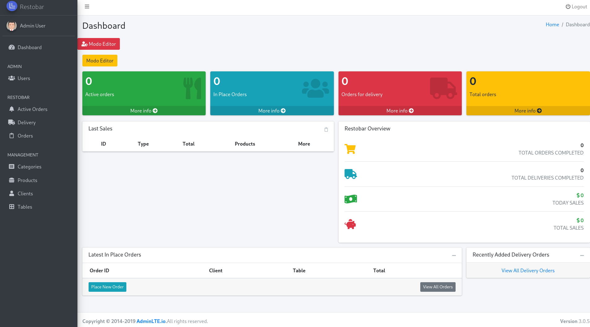 |
| Formulario de registro/edición de usuarios con datos personales y credenciales | 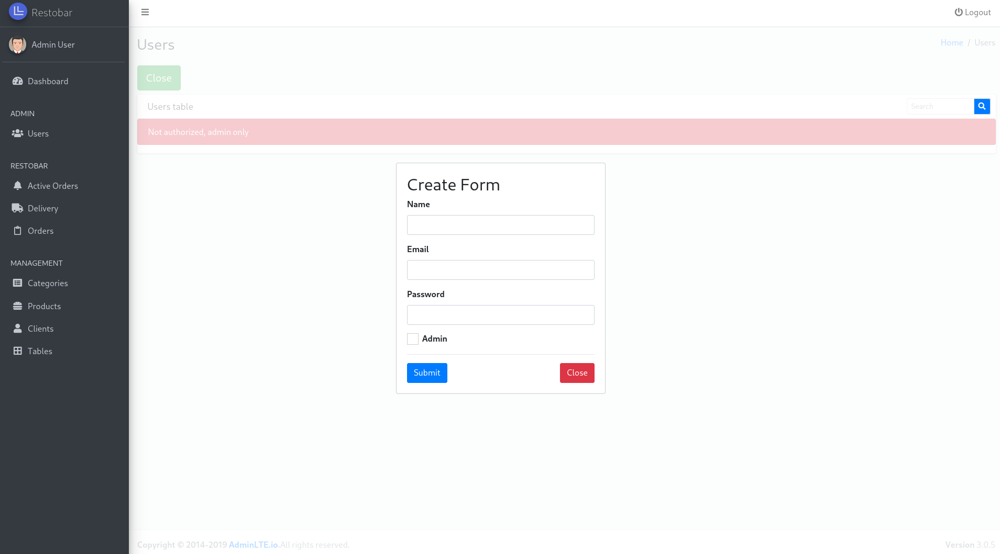 |
| Panel de administración de roles: define funciones y restricciones de acceso | 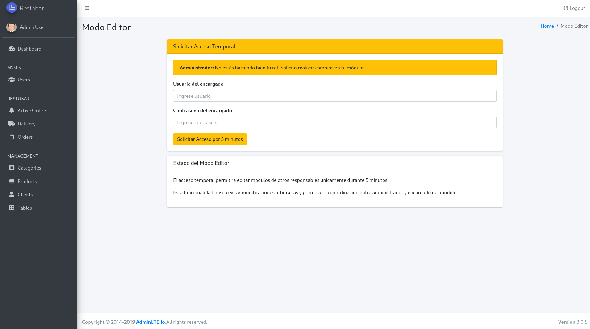 |
| Sección de permisos: establece acciones disponibles por rol |  |

</details>

---

### 💰 Módulo de Caja — Facturas
Centraliza todas las operaciones financieras del restaurante. Soporta pagos por efectivo, tarjeta, transferencia bancaria y Yape. Genera automáticamente facturas o boletas por cada transacción. Incluye un panel de estadísticas con filtros por día, semana, mes y año, gráficos de barras y diagramas circulares (plato más vendido, ingresos por período), y una sección separada de gestión de gastos (almacén, mantenimiento, alquiler, impuestos).

<details>
<summary>Ver capturas</summary>

| Descripción | Captura |
|---|---|
| Panel principal: resumen de ingresos, gastos, ganancias y pagos | 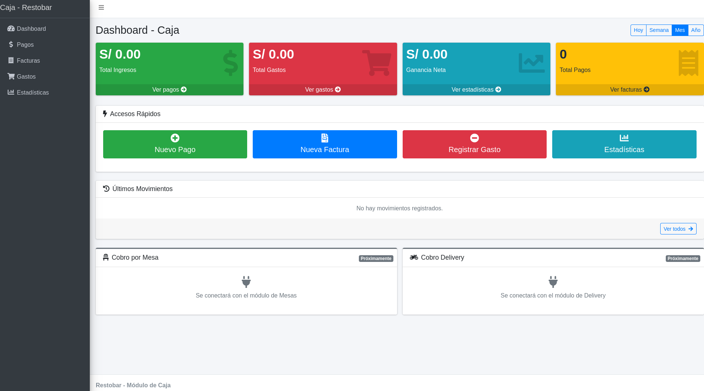 |
| Gestión de pagos: registro y consulta de transacciones | 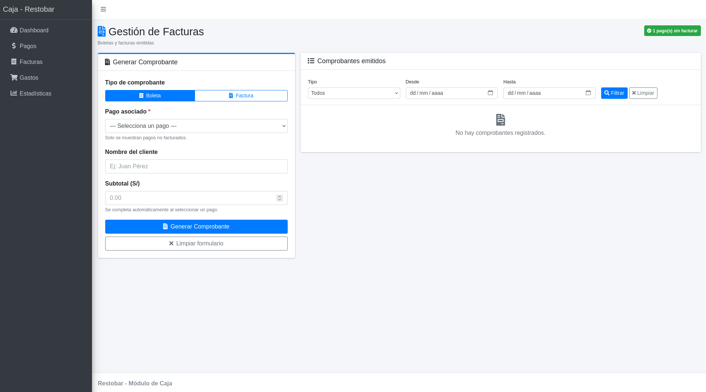 |
| Pantalla de generación de comprobantes de pago | 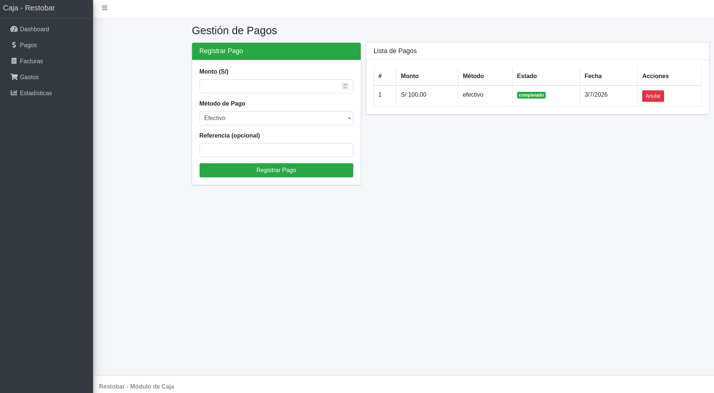 |
| Formulario de emisión de boletas o facturas |  |
| Confirmación y listado de comprobantes emitidos |  |
| Vista detallada del comprobante de venta |  |
| Previsualización del comprobante antes de imprimir |  |
| Gestión de gastos: registro y control de egresos |  |
| Estadísticas: indicadores de ingresos, gastos y utilidad neta | 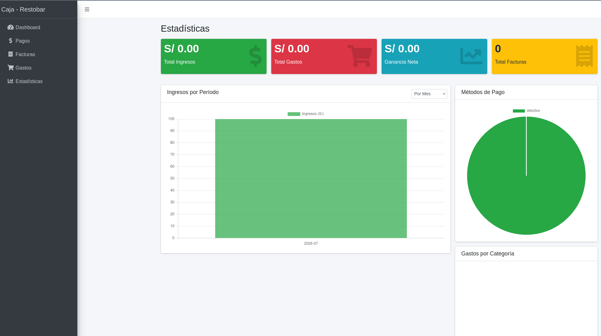 |
| Gráficos de métodos de pago y categorías de gasto |  |

</details>

---

### 🍳 Módulo de Cocina — Almacén — Menú
Gestiona el proceso completo de preparación de alimentos. Cada plato en cola muestra sus etapas de cocción con temporizadores configurables (ej. Bistec: Cociendo 4min → Terminado). Al completar un paso, el sistema actualiza automáticamente el queue y calcula el promedio acumulado de tiempos por plato. El módulo de menú incluye el stock de insumos por plato, actualizado en tiempo real conforme se preparan los pedidos.

<details>
<summary>Ver capturas</summary>

| Descripción | Captura |
|---|---|
| Panel de cocina: pedidos pendientes, en preparación y completados | 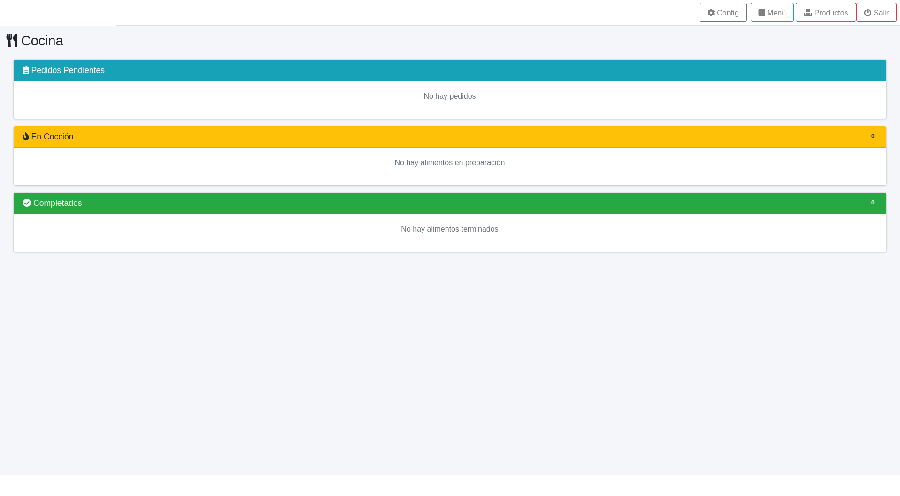 |
| Configuración de tiempos de preparación por producto |  |
| Menú y stock de provisiones: gestión de ingredientes por plato | 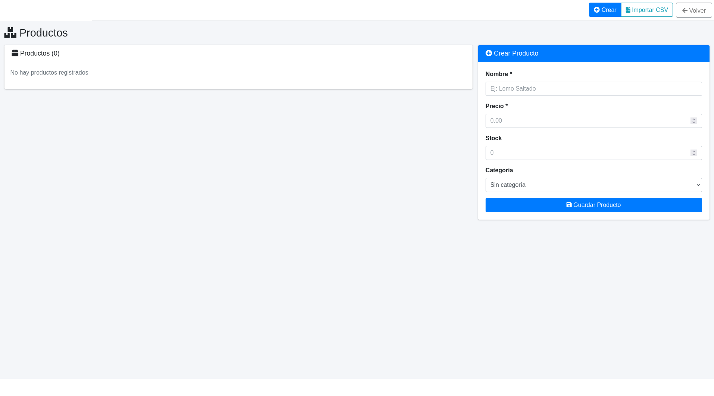 |

</details>

---

### 🛵 Módulo de Delivery
Gestiona pedidos para despacho a domicilio. En la implementación actual funciona como simulación interna de pedidos por llamada. Incluye soporte para pagos con efectivo, tarjeta y transferencia bancaria, con interfaz rediseñada para mayor claridad operativa.

<details>
<summary>Ver capturas</summary>

| Descripción | Captura |
|---|---|
| Pantalla principal del módulo Delivery | 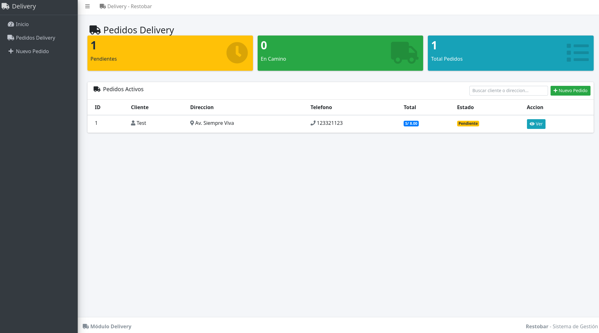 |
| Lista de pedidos delivery: estado, cliente y acciones | 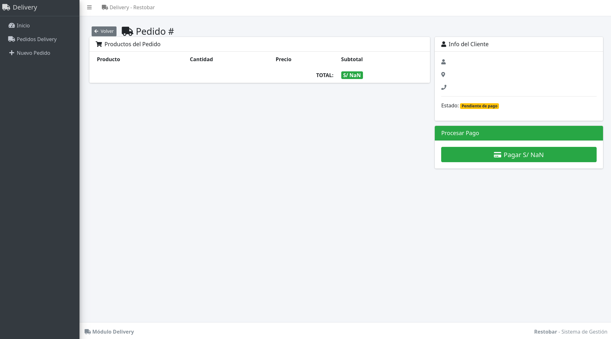 |
| Detalle de pedido: productos, datos del cliente y total |  |
| Pago con tarjeta | 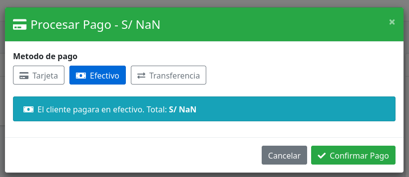 |
| Pago en efectivo: confirmación de entrega | 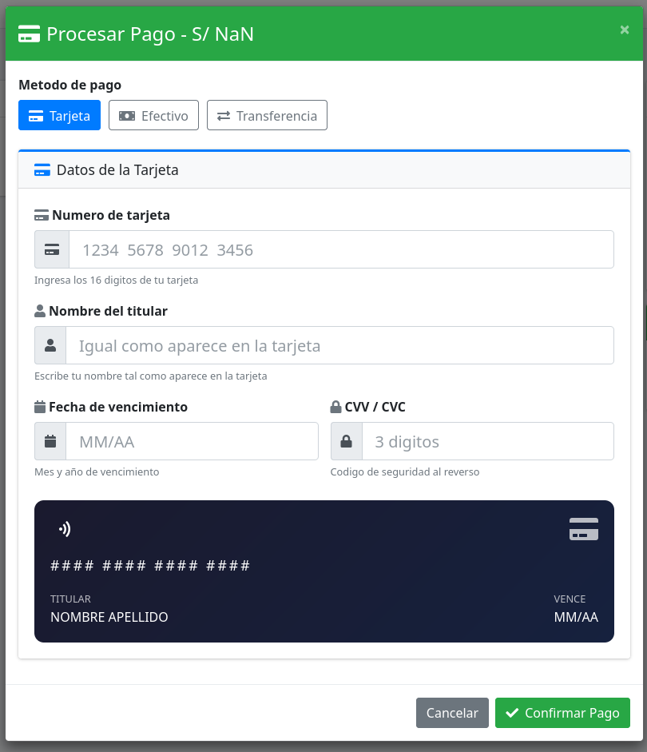 |
| Pago por transferencia bancaria |  |
| Confirmación de pago exitoso |  |
| Formulario de nuevo pedido delivery | 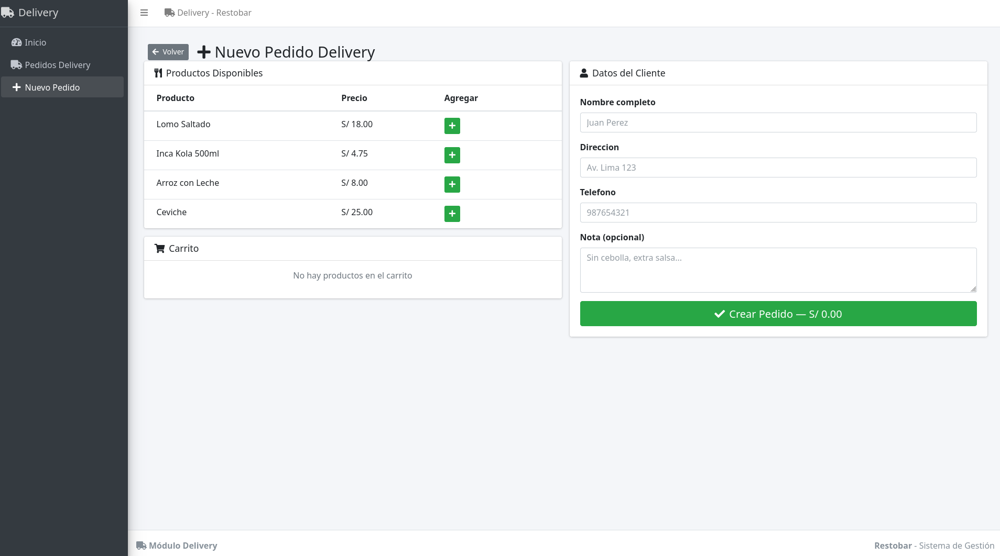 |

</details>

---

### 🪑 Módulo de Mesas
Centro de comunicación entre módulos. Gestiona el ciclo de vida de las mesas: creación, edición y eliminación; visualización en tiempo real del estado de ocupación; y detección/emisión de eventos hacia los módulos de Mozo, Caja y Cocina.

<details>
<summary>Ver capturas</summary>

| Descripción | Captura |
|---|---|
| Panel principal: estado de mesas en tiempo real, contador de libres/ocupadas y asignación de clientes | 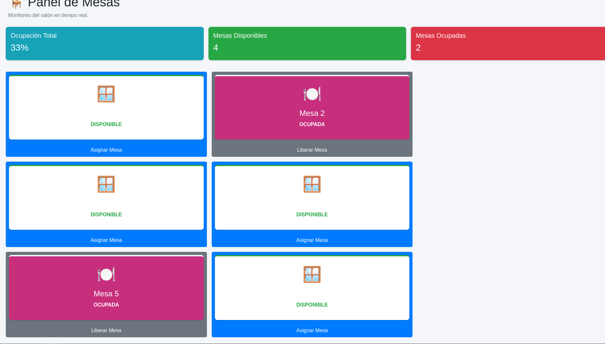 |

</details>

---

### 🧑‍🍳 Módulo de Mozo *(Sprint 3 — En planificación)*
Interfaz optimizada para móvil. Mostrará mesas disponibles y emitirá notificaciones visuales/sonoras con ventana emergente al recibir un llamado de mesa. Requiere WebSockets para la capa de tiempo real; desarrollo programado para Sprint 3.

---

## Stack Tecnológico

| Capa | Tecnología |
|---|---|
| Frontend | ReactJS + Redux |
| Backend | Node.js + Express (API REST) |
| Base de datos | MySQL + Sequelize (ORM) |
| Servidor web | Nginx (reverse proxy) |
| Contenedores | Docker + docker-compose |
| Monorepo | Turborepo (pnpm workspaces) |
| CI/CD | GitHub Actions |
| UI Base | AdminLTE |

---

## Arquitectura

El sistema sigue el patrón **MVC** organizado en una arquitectura **Monorepo con Turborepo**:

```
Proyecto-IPS-restobar/
├── apps/
│   ├── backend/        # Node.js + Express — API REST (puerto 5003)
│   └── frontend/       # React + Redux — SPA (puerto 3002)
├── packages/           # Código compartido entre apps
├── turbo.json          # Configuración de tareas y caché incremental
└── docker-compose.yml  # Orquestación de servicios
```

El frontend se comunica con el backend vía API REST. Nginx actúa como proxy inverso en el puerto 80. Todo el stack se orquesta con Docker Compose para garantizar la reproducibilidad del entorno.

---

## Instalación y Ejecución

### Prerrequisitos

- [Node.js](https://nodejs.org/) (v18+)
- [pnpm](https://pnpm.io/) — gestor de paquetes
- [MySQL](https://www.mysql.com/) (o [WAMP](https://www.wampserver.com/en/) / [XAMPP](https://www.apachefriends.org/))

### Pasos

1. **Clonar el repositorio**
   ```sh
   git clone https://github.com/Arg128/Proyecto-IPS-restobar.git
   cd Proyecto-IPS-restobar
   ```

2. **Instalar pnpm** (si no lo tienes)
   ```sh
   npm install -g pnpm
   ```

3. **Instalar dependencias** (desde la raíz del monorepo)
   ```sh
   pnpm install
   ```

4. **Configurar variables de entorno**

   Ve a `apps/backend/`, copia `.env.example` y renómbralo a `.env`:
   ```
   NODE_ENV=development
   PORT=5003
   JWT_SECRET=tu_secreto
   DB_USER=root
   DB_NAME=restobar
   DB_PASSWORD=tu_password
   DB_HOST=localhost
   DB_DIALECT=mysql
   ```

5. **Crear la base de datos y poblarla**
   ```sh
   cd apps/backend
   npx sequelize-cli db:migrate
   npx sequelize-cli db:seed:all
   ```

6. **Ejecutar el proyecto** (desde la raíz)
   ```sh
   pnpm run dev
   ```

   El frontend estará disponible en `http://localhost:3002` y el backend en `http://localhost:5003`.

---

## Deploy con Docker

1. **Instalar [Docker](https://www.docker.com/)**

2. **Clonar el repositorio**
   ```sh
   git clone https://github.com/Arg128/Proyecto-IPS-restobar.git
   cd Proyecto-IPS-restobar
   ```

3. **Levantar los servicios**
   ```sh
   docker-compose up --build
   ```

   El sistema estará disponible en `http://localhost:80`.

---

## Pipeline CI/CD

El proyecto cuenta con un pipeline de integración y despliegue continuo configurado con **GitHub Actions** en `.github/workflows/`. Se activa automáticamente en cada push a `main`:

| Etapa | Descripción |
|---|---|
| Trigger | Push o Pull Request a `main` |
| Install | Instalación de dependencias (`pnpm install`) |
| Build | Compilación del frontend |
| Deploy | Publicación en GitHub Pages |

**Demo en vivo:** [Arg128.github.io/Proyecto-IPS-restobar](https://Arg128.github.io/Proyecto-IPS-restobar)

---

## Equipo

Proyecto desarrollado en el curso **Ingeniería y Procesos de Software** — UNSA, Semestre 2026-A  
**Docente:** Ing. Oscar Alberto Ramírez Valdez

| Rol | Integrante | Módulo |
|---|---|---|
| Product Owner / Dev | Sarmiento Tico Limberg Froilan | Administrador |
| Scrum Master / Dev | Retamozo Calatayud Angel Julio | Cocina — Almacén |
| Developer | Quispesayhua Hancco Joseph Brayan | Caja — Facturas |
| Developer | Quispe Rupaylla Fabrizio Alonso | Delivery |
| Developer | Mamani Solorzano Efrain Alex | Mesas |

---

## Estado del Proyecto

**Hito actual: Hito 2 (Sprint 1 y 2) — 60% de avance**

| Módulo | Responsable | Estado | Avance |
|---|---|---|---|
| Caja — Facturas | Quispesayhua H. J.B. | 🔄 En desarrollo | 65% |
| Mesas | Mamani Solorzano E.A. | ✅ Ready | 70% |
| Delivery | Quispe Rupaylla F.A. | ✅ Ready | 70% |
| Cocina — Almacén | Retamozo Calatayud A.J. | 🔄 En desarrollo | 60% |
| Mozo | — | 📋 Backlog (Sprint 3) | 0% |
| Administrador | Sarmiento Tico L.F. | 📋 Backlog (Sprint 3–4) | 0% |

**Roadmap:**
- **Hito 3 (Sprint 3 y 4 — Jul 2026):** Módulos Mozo, Administrador, integración WebSockets, pruebas end-to-end y despliegue en producción.

---

## Licencia

Distribuido bajo la **Licencia MIT**. Ver [`LICENSE`](./LICENSE) para más información.

---

## Agradecimientos

Basado en el trabajo original de [Matías Rivera](https://github.com/matias-rivera/restobar).

- [express-async-handler](https://github.com/Abazhenov/express-async-handler)
- [express-validator](https://express-validator.github.io/docs/)
- [jsonwebtoken](https://github.com/auth0/node-jsonwebtoken)
- [multer](https://github.com/expressjs/multer)
- [nodemon](https://github.com/remy/nodemon)
- [bcrypt](https://github.com/kelektiv/node.bcrypt.js)
- [redux-thunk](https://github.com/reduxjs/redux-thunk)
- [axios](https://github.com/axios/axios)
- [Turborepo](https://turbo.build/repo)
- [AdminLTE](https://adminlte.io/)
- [Font Awesome](https://fontawesome.com)
